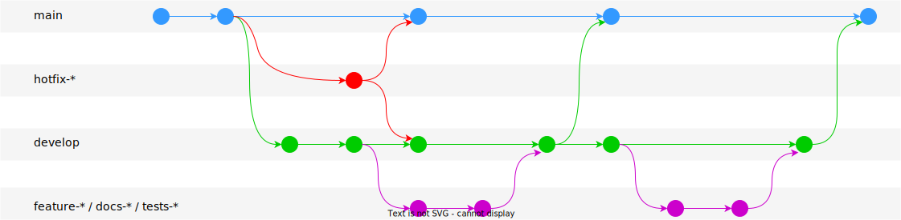
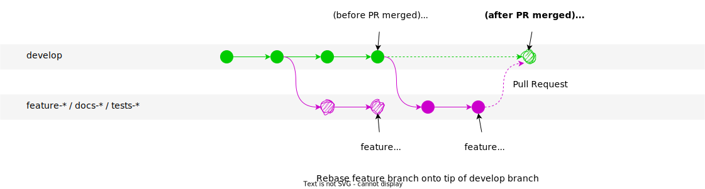

# Dev Workflow Management

## Gitflow Pattern

Follow a branch + pull-request pattern to create a commit tree structure that matches this structure:



- When starting a new feature/fix/docs/etc. branch, make a small initial commit and push it to Github;
open a Pull Request immediately so others can track your progress (see what to write in the PR description in Pull Request Conventions).
- Commit new work to your local branches and regularly push work to the remote; the Pull Request should reflect these changes immediately.
- To request feedback or help, or when you think your work is ready to merge into the `develop` branch, assign a 'reviewer' to do a **Code Review** (see Code Review Practices).
- After your work or feature has been *reviewed and approved*, it can be merged into the `develop` branch.

## Branches

### `main` branch

- Any code in the `main` branch should be deployable.
- Only use Pull Requests to merge into `main` branch.
- Only ever base merges from the `develop` branch into `main` branch.

### `develop` branch

- Maintain a `develop` For *anything larger than a WIP/experimental* project.
- All new work should branch out of `develop` – never out of `main` except for `hotfix-*`

### Feature/Tests/Docs branches

- Create new descriptively-named branches off the `develop` branch (only!) for new work, such as `taylor/feature-add-new-payment-types` (see full naming convention in Branch Conventions).
- Always add new tests to confirm the major behavior of your features (Use HAPPY/BAD/SAD tests).
- Make sure to test and refactor your feature branches before merging into `develop`

If Github tells you that your PR to merge back into `develop` has conflicts with `develop` (i.e., there have been new, conflicting commits on `develop` since after your branched out), please rebase your work on rebase before trying to merge back into it using a PR.

The rebase restructuring strategy looks like this:




And the corresponding code will be like:

```shell
# Start on your `feature` (or tests, docs) branch
git switch develop
git pull

git switch feature
git rebase develop

# Rebasing will be interrupted by conflicts
# (fix all the conflicts and add them to staging)
# ...
git add .

# Continue the rebase
git rebase --continue
```

### Hotfix branches

If a *quick-but-urgent* fix is needed on `main`, branch from `main` and open a `hotfix-*` branch.

- Create a failing test to detect the bug/issue
- Fix the issue
- Commit and push to remote `origin`
- Open a Pull Request to merge into `main`
- After the PR is accepted, do another PR to merge it into `develop`

## Reference

[GitHub](https://docs.github.com/en/get-started/quickstart/github-flow)
[Gitkraken](https://www.gitkraken.com/learn/git/best-practices/git-branch-strategy)
