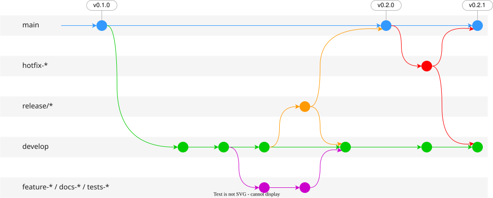
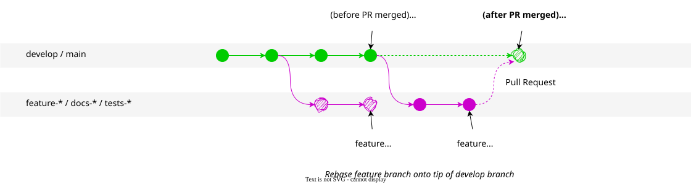

# Git Workflow: Semver Versioned Software

Use this workflow for projects with semantic versioning releases, such as R packages, Python packages, and libraries.

## Gitflow Pattern

Follow a branch + pull-request pattern to create a commit tree structure that matches this structure:



- When starting a new feature/fix/docs/etc. branch, make a small initial commit and push it to Github; open a Pull Request immediately so others can track your progress (see Pull Request Conventions).
- Commit new work to your local branches and regularly push work to the remote; the Pull Request should reflect these changes immediately.
- To request feedback or help, or when you think your work is ready to merge into the `develop` branch, assign a reviewer to do a **Code Review** (see Code Review Practices).
- After your work or feature has been reviewed and approved, it can be merged into the `develop` branch.

## Branches

### `main` branch

- Any code in the `main` branch should be deployable.
- Only use Pull Requests to merge into `main`.
- Only merge from `release/*` or `hotfix/*` branches into `main`.
- Tag every merge to `main` with the release version (e.g., `v1.2.0`).

### `develop` branch

- Maintain a `develop` branch for anything larger than a WIP/experimental project.
- All new work should branch out of `develop` — never out of `main` (except `hotfix/*` branches).

### Feature/Tests/Docs branches

- Create new descriptively-named branches off the `develop` branch for new work, such as `taylor/feature-add-new-payment-types` (see Branch Naming Conventions).
- Always add new tests to confirm the major behavior of your features (use HAPPY/BAD/SAD tests).
- Make sure to test and refactor your feature branches before merging into `develop`.

### Release branches

- Branch from `develop` when it is ready for a new release: `release/<version>` (e.g., `release/1.2.0`).
- Release branches do not use the `author/` prefix since they are shared.
- Use the release branch only for stabilization — bug fixes, documentation, and version bumps. No new features.
- When the release is ready, merge the release branch into `main` and tag it (e.g., `v1.2.0`).
- Merge the release branch back into `develop` to incorporate any fixes made during stabilization.
- Delete the release branch after merging.

### Hotfix branches

If a quick-but-urgent fix is needed on `main`, branch from `main` and open a `hotfix/*` branch.

- Create a failing test to detect the bug/issue.
- Fix the issue.
- Commit and push to remote `origin`.
- Open a Pull Request to merge into `main`; tag the merge with a patch version bump (e.g., `v1.2.1`).
- After the PR is accepted, merge the hotfix into `develop` as well.

## Rebasing

**Regularly rebase your feature branch onto the tip of `develop`**, if `develop` is being updated by other pull requests. You will notice this when Github tells you that your PR to merge back into `develop` has conflicts (i.e., there have been new, conflicting commits on `develop` since you branched out).

The rebase restructuring strategy looks like this:



And the corresponding commands:

```shell
# Start on your feature (or tests, docs) branch
git switch develop
git pull

git switch feature
git rebase develop
```

**Rebasing will often be interrupted by conflicts** (this is normal)

- Fix all the code conflicts by hand (choose 'current' or 'incoming' changes).
- In case of conflicts in package version specs (e.g., `Gemfile.lock`) or auto-generated test outputs (e.g., code coverage report, new VCR fixtures), accept 'current' version instead of 'incoming' changes, and rerun the relevant procedure (e.g., `bundle update` for packaging, or `rake spec` for tests).
- If things are hopelessly broken and you cannot resolve it, stop the rebase: `git rebase --abort`
- Otherwise, add all resolved files to staging and continue the rebase process.

```shell
git add .

# Continue the rebase
git rebase --continue
```

If the feature branch is already pushed on `origin` (remote), you will have to force push it because the commit IDs have changed.

```shell
git push --force origin feature
```

## Reference

- [GitHub Flow](https://docs.github.com/en/get-started/quickstart/github-flow)
- [Gitkraken Git Branch Strategy](https://www.gitkraken.com/learn/git/best-practices/git-branch-strategy)
