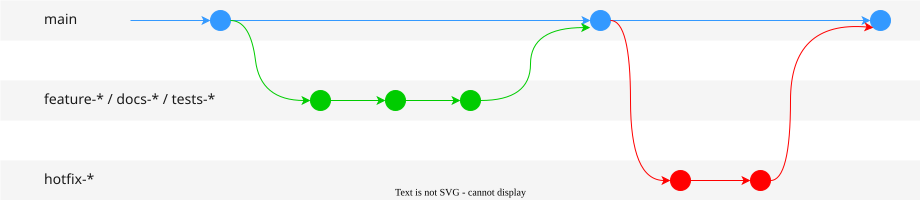

# Git Workflow: End-User Services

Use this workflow for deployed applications such as web apps, mobile apps, and services. There are no version releases — `main` always reflects the latest deployable state.

## Trunk-Based Pattern

Follow a branch + pull-request pattern where all work branches from `main` and merges back to `main`:



- When starting new work, branch from `main`, make a small initial commit, and push it to Github; open a Pull Request immediately so others can track your progress (see Pull Request Conventions).
- Commit new work to your local branches and regularly push work to the remote; the Pull Request should reflect these changes immediately.
- To request feedback or help, or when you think your work is ready to merge, assign a reviewer to do a **Code Review** (see Code Review Practices).
- After your work has been reviewed and approved, it can be merged into `main`.
- All changes require a Pull Request — no direct commits to `main`.

## Branches

### `main` branch

- Any code in the `main` branch should be deployable.
- Only use Pull Requests to merge into `main`.
- There is no `develop` branch and no `release` branches in this workflow.

### Feature/Tests/Docs branches

- Create new descriptively-named branches off `main` for new work, such as `taylor/feature-add-new-payment-types` (see Branch Naming Conventions).
- Always add new tests to confirm the major behavior of your features (use HAPPY/BAD/SAD tests).
- Make sure to test and refactor your feature branches before merging into `main`.

### Hotfix branches

If a quick-but-urgent fix is needed, branch from `main` and open a `hotfix/*` branch. The flow is the same as a feature branch, but the `hotfix` category signals urgency and priority.

- Create a failing test to detect the bug/issue.
- Fix the issue.
- Commit and push to remote `origin`.
- Open a Pull Request to merge into `main`.

## Rebasing

**Regularly rebase your feature branch onto the tip of `main`**, if `main` is being updated by other pull requests. You will notice this when Github tells you that your PR to merge back into `main` has conflicts (i.e., there have been new, conflicting commits on `main` since you branched out).

The rebase restructuring strategy looks like this:


And the corresponding commands:

```shell
# Start on your feature (or tests, docs) branch
git switch main
git pull

git switch feature
git rebase main
```

**Rebasing will often be interrupted by conflicts** (this is normal)

- Fix all the code conflicts by hand (choose 'current' or 'incoming' changes).
- In case of conflicts in package version specs (e.g., `Gemfile.lock`) or auto-generated test outputs (e.g., code coverage report, new VCR fixtures), accept 'current' version instead of 'incoming' changes, and rerun the relevant procedure (e.g., `bundle update` for packaging, or `rake spec` for tests).
- If things are hopelessly broken and you cannot resolve it, stop the rebase: `git rebase --abort`
- Otherwise, add all resolved files to staging and continue the rebase process.

```shell
git add .

# Continue the rebase
git rebase --continue
```

If the feature branch is already pushed on `origin` (remote), you will have to force push it because the commit IDs have changed.

```shell
git push --force origin feature
```

## Reference

- [GitHub Flow](https://docs.github.com/en/get-started/quickstart/github-flow)
- [Gitkraken Git Branch Strategy](https://www.gitkraken.com/learn/git/best-practices/git-branch-strategy)
